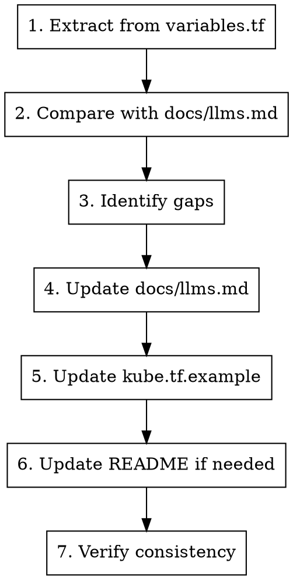

# Sync Documentation

## Overview

Ensure documentation is synchronized across all key files when variables or features change.

## Usage

```
/sync-docs
```

## Documentation Files

| File | Purpose | Priority |
|------|---------|----------|
| `variables.tf` | Source of truth for all variables | PRIMARY |
| `docs/llms.md` | Comprehensive variable reference | HIGH |
| `kube.tf.example` | Working example configuration | HIGH |
| `README.md` | Project overview and quick start | MEDIUM |
| `MIGRATION.md` | Operator-facing upgrade contract and v2 -> v3 variable map | HIGH for major upgrades |
| `docs/v2-to-v3-migration.md` | Stepwise migration playbook | HIGH for major upgrades |
| `docs/selinux.md` | SELinux policy provenance and AVC workflow | HIGH for SELinux changes |
| `docs/v3-release-evidence.md` | Live proof and release evidence | HIGH for release claims |
| `docs/terraform.md` | Auto-generated terraform docs | AUTO |
| `docs/index.md` | Curated documentation map and routing hub | HIGH |
| `docs/support-matrix.md` | Detailed capability and maturity contract | HIGH |
| `docs/operations.md` | Day-2 access, scaling, and cluster operations | MEDIUM |
| `docs/upgrades.md` | Module, Kubernetes, and transactional OS upgrades | HIGH |
| `docs/troubleshooting.md` | Incident diagnosis and recovery procedures | HIGH |
| `docs/recipes.md` / `docs/recipes/*` | Advanced configuration recipe index and focused guides | MEDIUM |
| `docs/v3-topology-recommendations.md` | Topology chooser and release-shaping guidance | MEDIUM |
| `examples/*/README.md` | Feature-specific operator examples | MEDIUM |
| `tests/README.md` | Test gate expectations and live-test notes | MEDIUM |
| `.claude/skills/*/SKILL.md` | Agent/operator workflows | MEDIUM |

## Workflow



## Step 1: Extract Variables from Source

Use exact extraction before semantic review:

```bash
# List all variables from variables.tf
rg -o '^variable "[^"]+"' variables.tf | cut -d'"' -f2 | sort -u

# Get variable details
sed -n '/^variable "<name>"/,/^}/p' variables.tf
```

## Step 2: Find Undocumented Variables

```bash
# Compare source variable names with code-formatted names in docs/llms.md
comm -23 \
  <(rg -o '^variable "[^"]+"' variables.tf | cut -d'"' -f2 | sort -u) \
  <(rg -o '`[a-zA-Z_][a-zA-Z0-9_]*`' docs/llms.md | tr -d '`' | sort -u)
```

## Step 3: Generate Documentation

### docs/llms.md Format

```markdown
**Variable Name**

```tf
variable_name = "default_value"
```

* **`variable_name` (Type, Optional/Required):**
  * **Default:** `default_value`
  * **Purpose:** Clear explanation of what this does
  * **Usage:** When and how to use it
  * **Considerations:** Important notes, limitations, impacts
  * **Example:** Practical usage example if helpful
```

### kube.tf.example Format

```tf
  # Description of what this controls
  # Additional context if needed
  # variable_name = "default_value"
```

## Step 4: Update docs/llms.md

For each undocumented variable:

1. Read variable definition from `variables.tf`
2. Understand its usage in `locals.tf` and other files
3. Write comprehensive documentation following the format above
4. Place in appropriate section of `docs/llms.md`

### Section Organization in docs/llms.md

| Section | Variables |
|---------|-----------|
| Cluster Basics | cluster_name, hcloud_token, ssh_* |
| Network | network_*, subnet_* |
| Control Plane | control_plane_* |
| Agents | agent_*, autoscaler_* |
| Load Balancer | lb_*, traefik_*, nginx_* |
| CNI | cni_*, cilium_*, calico_* |
| Node Transport | node_transport_mode, tailscale_* |
| Storage | longhorn_* |
| Security | firewall_*, audit_* |
| Advanced | Additional/misc options |

## Step 5: Update kube.tf.example

Ensure new variables appear in the example with:
- Clear comment explaining purpose
- Commented out with default value
- Grouped with related variables

```bash
# Inspect source variables that do not appear in kube.tf.example
comm -23 \
  <(rg -o '^variable "[^"]+"' variables.tf | cut -d'"' -f2 | sort -u) \
  <(rg -o '[a-zA-Z_][a-zA-Z0-9_]*[[:space:]]*=' kube.tf.example | sed 's/[[:space:]]*=//' | sort -u)
```

## Step 6: Update README if Needed

Update README.md if:
- New major feature added
- New CNI or ingress option
- Significant capability change

README is the visual project entry point, four-step Quick Start, and
documentation router. Keep the running-cluster image in the opening block and
keep README at or below the contract limit enforced by
`scripts/tests/test_generated_site_contract.sh`. Put debugging, upgrade,
day-2 operations, long support notes, and advanced recipes in their focused
guides; add or update the route in `docs/index.md` instead of growing README.

When moving README content, keep repository-relative links valid from the new
directory depth and regenerate `site-docs/index.md` with
`python3 scripts/sync_docs_site.py`. The generator rewrites extracted README
links for the `site-docs/` directory; verify them with the generated-site
contract test.

Features section should match actual capabilities.

For Tailscale changes, keep these surfaces in sync:
- `docs/support-matrix.md` support levels and `docs/recipes/networking-and-scale.md` Tailscale recipe
- `kube.tf.example` Tailscale node-transport comments
- `docs/llms.md` support levels and variable notes
- `docs/v3-topology-recommendations.md`
- `examples/tailscale-node-transport/README.md`
- `examples/external-overlay-tailscale/README.md`
- `examples/external-overlay-cloudflare-access/README.md` when access-boundary wording changes
- `.claude/skills/kh-assistant/SKILL.md`
- `.claude/skills/migrate-v2-to-v3/SKILL.md`

For Cloudflare Zero Trust wording, keep the boundary consistent:
- Cloudflare Access/Tunnel is a documented external operator/app access pattern.
- kube-hetzner does not add Cloudflare provider inputs or manage Cloudflare resources.
- Cloudflare Mesh/WARP is not supported kube-hetzner node transport in v3.
- Tailscale remains the supported managed node transport for secure multinetwork scale.

For Cilium Gateway API changes, keep these surfaces in sync:
- `variables.tf` validation for `cilium_gateway_api_enabled`
- `locals.tf` Cilium values and Gateway API CRD version mapping
- `README.md`
- `kube.tf.example`
- `docs/llms.md`
- `docs/v3-topology-recommendations.md`
- `examples/cilium-gateway-api/README.md`
- `.claude/skills/kh-assistant/SKILL.md`
- `.claude/skills/test-changes/SKILL.md`

For embedded registry mirror changes, keep these surfaces in sync:
- `variables.tf` validation for `embedded_registry_mirror`
- `locals.tf` effective generated registries YAML merge behavior
- host/control-plane/agent/autoscaler config rendering
- `README.md`
- `kube.tf.example`
- `docs/llms.md`
- `docs/v3-topology-recommendations.md`
- `.claude/skills/kh-assistant/SKILL.md`
- `.claude/skills/test-changes/SKILL.md`

For v2 -> v3 migration or production-upgrade safety changes, keep these
surfaces in sync:
- `MIGRATION.md`, especially "Production in-place upgrades: safety model"
- `docs/v2-to-v3-migration.md`
- `CHANGELOG.md` upgrade notes
- `docs/v3-release-evidence.md` live proof
- `.claude/skills/migrate-v2-to-v3/SKILL.md`
- `.claude/skills/upgrade-cluster/SKILL.md`
- `.claude/skills/kh-assistant/SKILL.md`

The no-destroy gate must include the full protected hcloud set:
`hcloud_server`, `hcloud_network`, `hcloud_network_subnet`,
`hcloud_load_balancer`, `hcloud_volume`, `hcloud_primary_ip`,
`hcloud_placement_group`, and `hcloud_firewall`.

For SELinux changes, keep these surfaces in sync:
- `docs/selinux.md`
- `templates/kube-hetzner-selinux.te`
- `templates/k8s-custom-policies.te`
- `variables.tf` `enable_selinux` and per-pool `selinux`
- `.claude/skills/debug-node/SKILL.md`
- `.claude/skills/kh-assistant/SKILL.md`

Do not make generic "disable SELinux" recommendations. The operator path is
AVC evidence, udica-first workload policy, upstream module policy only with
reproducible denials, and per-pool `selinux = false` as the last resort.

For release presentation changes, verify README's compact current-release link
points at the latest release tag and that `CHANGELOG.md` contains the release
content.

## Step 7: Verify Consistency

Run the exact comparisons above, `terraform-docs`, the generated-site contract,
and the relevant validators from `/test-changes`. Then inspect defaults and
descriptions for each changed variable directly in all three surfaces.

### Verification Checklist

- [ ] All variables.tf variables documented in docs/llms.md
- [ ] All major variables appear in kube.tf.example
- [ ] README features match actual capabilities
- [ ] No typos in variable names across files
- [ ] Default values consistent across docs
- [ ] Major-upgrade safety wording matches `MIGRATION.md`
- [ ] SELinux workload-denial wording points to `docs/selinux.md`
- [ ] README current-release URL is current for the release train

## Common Sync Issues

### Variable renamed
1. Update in variables.tf
2. Search and replace in docs/llms.md
3. Search and replace in kube.tf.example
4. Add to CHANGELOG.md (breaking change!)

### Variable removed
1. Remove from variables.tf
2. Remove from docs/llms.md
3. Remove from kube.tf.example
4. Add to CHANGELOG.md (breaking change!)

### Default changed
1. Update in variables.tf
2. Update in docs/llms.md
3. Update in kube.tf.example
4. Consider if this is a breaking change

## Quick Commands

```bash
# Regenerate terraform docs
terraform-docs markdown table --config .terraform-docs.yml \
  --output-mode inject --output-file docs/terraform.md .

# Validate v3 topology/Gateway/registry surfaces
uv run scripts/validate_v3_final_polish_examples.py

# Validate rendered templates and negative contract cases when those surfaces change
uv run scripts/render_harness.py
uv run scripts/contract_negative_tests.py

# Search for variable across all docs
rg -n "variable_name" docs/ kube.tf.example README.md

# Find undocumented variables (quick check)
diff <(rg -o 'variable "([^"]+)"' -r '$1' variables.tf | sort) \
     <(rg -o '`[a-z_]+`' docs/llms.md | tr -d '`' | sort -u) | rg "^<"
```

## After Sync

1. Run `terraform fmt -recursive`
2. Commit only if the current task calls for a commit, with message: `docs: sync documentation with variables.tf`
3. If breaking changes, update CHANGELOG.md
