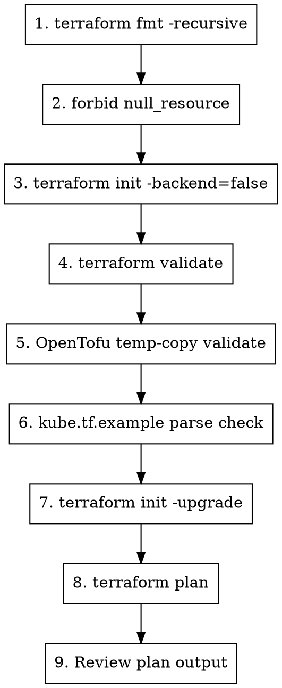

# Test Terraform Changes

## Overview

Run the standard validation suite for Terraform/OpenTofu changes against the test environment.

## Usage

```
/test-changes
```

## Test Environment

- **Module code:** current git worktree (`git rev-parse --show-toplevel`)
- **Test cluster:** an existing cluster Terraform root supplied by the operator
  (`<existing-cluster-terraform-root>` in examples below)

## Workflow



## Step 1: Format Check

```bash
cd "$(git rev-parse --show-toplevel)"
terraform fmt -recursive
```

**Must pass before proceeding.**

## Step 2: Forbid null_resource Usage

```bash
cd "$(git rev-parse --show-toplevel)"
if rg -n 'resource[[:space:]]+"null_resource"|provider[[:space:]]+"null"|hashicorp/null' -g '*.tf' -g '*.tf.json' .; then
  echo "Use terraform_data instead of null_resource/hashicorp/null. Moved blocks from old null_resource addresses are allowed for state migration."
  exit 1
fi
```

**Must pass before proceeding.** Any operational placeholder resource should use
the built-in `terraform_data` resource. Keep `moved` blocks that reference old
`null_resource` addresses because they preserve upgrade/state migration safety.

## Step 3: Initialize Local Providers

```bash
cd "$(git rev-parse --show-toplevel)"
terraform init -backend=false
```

**Must pass before proceeding.**

## Step 4: Validate Module

```bash
cd "$(git rev-parse --show-toplevel)"
terraform validate -no-color
```

**Must pass before proceeding.**

## Step 5: Validate OpenTofu Compatibility

```bash
cd "$(git rev-parse --show-toplevel)"
tmpdir="$(mktemp -d)"
rsync -a --exclude .git --exclude .terraform --exclude .terraform-tofu ./ "$tmpdir"/
(cd "$tmpdir" && tofu init -backend=false -input=false && tofu validate -no-color)
rm -rf "$tmpdir"
```

**Must pass before proceeding.** OpenTofu is officially supported and should
catch the same module-contract validation errors as Terraform during plan. Use
a temporary copy when validating both CLIs so OpenTofu cannot rewrite the
ignored `.terraform.lock.hcl` or local plugin cache in the main Terraform
checkout. Cross-variable contract failures are enforced by
`terraform_data.validation_contract`, so invalid-combination tests should assert
`terraform plan`, not only `terraform validate`.

## Step 6: Validate `kube.tf.example` Parseability

```bash
cd "$(git rev-parse --show-toplevel)"
MODULE_ROOT="$PWD"
tmpdir="$(mktemp -d)"
cp kube.tf.example "$tmpdir/main.tf"
MODULE_ROOT="$MODULE_ROOT" perl -0pi -e 's#source = "kube-hetzner/kube-hetzner/hcloud"#source = "$ENV{MODULE_ROOT}"#' "$tmpdir/main.tf"
(cd "$tmpdir" && terraform fmt -check main.tf && terraform init -backend=false && terraform validate)
```

**Must pass before proceeding.**

## Step 6.5: Validate Large Tailscale Examples

```bash
cd "$(git rev-parse --show-toplevel)"
uv run scripts/validate_tailscale_large_scale_examples.py
```

**Must pass when Tailscale node transport, multinetwork, autoscaler, placement
group, or example docs change.** This checks the +100-node and
10,000-total-node reference topology math without creating real 10k
infrastructure.

The v3 smoke matrix also covers public join endpoint family handling: IPv6-only
control-plane public joins must remain valid, and public joins without a real
public API host must fail before deployment. The helper retries transient
provider-download failures during `terraform init`.

## Step 6.6: Validate v3 Final-Polish Surfaces

```bash
cd "$(git rev-parse --show-toplevel)"
uv run scripts/validate_v3_final_polish_examples.py
```

**Must pass when topology docs, `cilium_gateway_api_enabled`,
`embedded_registry_mirror`, endpoint outputs, Cloudflare/Tailscale examples, or
skills change.**
This keeps the v3 topology chooser, Gateway API example, registry mirror
snippets, Cloudflare external-access boundary, and validation gates in sync.

## Step 6.7: Run v3 Blast-Radius Plan Matrix

```bash
cd "$(git rev-parse --show-toplevel)"
uv run scripts/smoke_v3_plan_matrix.py
```

**Must pass when Cilium Gateway API, embedded registry mirror, Tailscale node
transport, multinetwork validation, or endpoint-mode logic changes.** This
creates disposable Terraform roots and never applies, but it needs a real HCloud
token so successful plans can read provider data sources. It covers k3s and RKE2
Tailscale registry paths plus the single-Gateway-controller guard. Set
`SMOKE_HCLOUD_EXTERNAL_NETWORK_ID` if no existing HCloud Network is available
for the external-network Tailscale plan smoke.

## Step 7: Initialize Test Environment

```bash
cd <existing-cluster-terraform-root>
terraform init -upgrade
```

This picks up changes from the local module.

## Step 8: Plan Against Test Cluster

```bash
cd <existing-cluster-terraform-root>
terraform plan
```

### What to Look For

#### Good Signs
- Only expected resources change
- No unexpected additions/deletions
- Changes match your intended modifications

#### Red Flags (STOP!)

| Output | Meaning | Action |
|--------|---------|--------|
| `will be destroyed` | Resource recreation | **STOP** - Breaking change |
| `must be replaced` | Resource recreation | **STOP** - Breaking change |
| `forces replacement` | Resource recreation | **STOP** - Breaking change |
| Unexpected changes | Side effects | Investigate before proceeding |

### Breaking Change = MAJOR Release

If `terraform plan` shows ANY resource destruction on existing infrastructure:
1. **STOP** - This is NOT backward compatible
2. The change requires a MAJOR version bump
3. Migration guide is required
4. Consider alternative approaches first

### Empty-State Upgrade Gotcha

An empty state file is not an upgrade proof. It yields a fresh-deploy plan, so it
cannot prove whether a module branch preserves existing resources. When no live
upgrade root is available, use a tag-vs-branch plan-address-set diff as the
structural proxy: render the same config against the released tag and the branch,
save both plan JSON files, and compare sorted `.resource_changes[].address`
sets. Address churn is the signal to investigate before any live apply.

## Step 9: Review Plan Output

### Checklist

- [ ] `terraform fmt -recursive` passes
- [ ] no live `null_resource`/`hashicorp/null` usage exists
- [ ] `terraform init -backend=false` passes
- [ ] `terraform validate` passes
- [ ] OpenTofu temp-copy validation passes
- [ ] `kube.tf.example` parses against the local checkout
- [ ] `uv run scripts/validate_tailscale_large_scale_examples.py` passes when large-scale/Tailscale/networking examples are touched
- [ ] `uv run scripts/validate_v3_final_polish_examples.py` passes when Gateway API/registry/topology/Cloudflare boundary docs are touched
- [ ] `uv run scripts/smoke_v3_plan_matrix.py` passes when Gateway API/registry/Tailscale plan behavior is touched
- [ ] Tailscale node-transport static cases pass/fail as expected when variables/networking are touched
- [ ] `terraform plan` shows expected changes only
- [ ] No resource destruction
- [ ] No unexpected side effects
- [ ] Changes are backward compatible

## Quick Reference

```bash
# Full test sequence
cd "$(git rev-parse --show-toplevel)" && \
MODULE_ROOT="$PWD" && \
terraform fmt -recursive && \
if rg -n 'resource[[:space:]]+"null_resource"|provider[[:space:]]+"null"|hashicorp/null' -g '*.tf' -g '*.tf.json' .; then exit 1; fi && \
terraform init -backend=false && \
terraform validate && \
tmpdir="$(mktemp -d)" && \
rsync -a --exclude .git --exclude .terraform --exclude .terraform-tofu ./ "$tmpdir"/ && \
(cd "$tmpdir" && tofu init -backend=false && tofu validate) && \
rm -rf "$tmpdir" && \
tmpdir="$(mktemp -d)" && cp kube.tf.example "$tmpdir/main.tf" && \
MODULE_ROOT="$MODULE_ROOT" perl -0pi -e 's#source = "kube-hetzner/kube-hetzner/hcloud"#source = "$ENV{MODULE_ROOT}"#' "$tmpdir/main.tf" && \
(cd "$tmpdir" && terraform fmt -check main.tf && terraform init -backend=false && terraform validate) && \
rm -rf "$tmpdir" && \
uv run scripts/validate_tailscale_large_scale_examples.py && \
uv run scripts/validate_v3_final_polish_examples.py && \
uv run scripts/smoke_v3_plan_matrix.py && \
cd <existing-cluster-terraform-root> && \
terraform init -upgrade && \
terraform plan
```

## Apply (Optional)

Only if plan looks correct and you want to test on actual infrastructure:

```bash
cd <existing-cluster-terraform-root>
terraform apply
```

**Caution:** This modifies real infrastructure. Only do this for thorough testing.

## Teardown After Live Tests

When destroying a live test root, run the module teardown helper from the
Terraform root:

```bash
cd <existing-cluster-terraform-root>
<module-checkout>/scripts/destroy.sh -auto-approve
```

`scripts/destroy.sh` is the recommended teardown path. It auto-retries only the
known benign ingress-LB detach race (`resource_already_detaching`/422 from dual
CCM and Terraform ownership), then prints a read-only orphan report including
unlabeled primary IPs, out-of-state autoscaled nodes, and exact managed load
balancer names. Use `scripts/cleanup.sh` only as the forceful fallback after the
report shows leftovers or state is already wrecked.

Autoscaler-created servers are not in Terraform state. If an autoscaled server
pins the network/subnet during destroy, delete it only after the control plane is
dead, or first scale the autoscaler pool to `min_nodes = 0`. Deleting it while
Cluster Autoscaler is alive with `min_nodes > 0` lets the autoscaler recreate it.

## CI Truth-Checking

For CI-backed verification, require completed success, not merely absence of
failures:

```bash
gh run list --repo kube-hetzner/terraform-hcloud-kube-hetzner --branch <branch> --limit 20
gh run view <run-id> --repo kube-hetzner/terraform-hcloud-kube-hetzner --json status,conclusion,attempt,workflowName,jobs
```

The render-harness `Lint` job once hid by hanging for its whole lifetime via
`setup-terraform`'s stdin-swallowing wrapper; `.github/workflows/lint_pr.yaml`
now keeps that wrapper disabled. Hetzner `resource_unavailable` or "error during
placement" is a capacity flake: use `gh run rerun <run-id> --failed`. Avoid
`gh run cancel` on in-flight Hetzner runs; it skips destroy and can orphan
attempt-suffixed `kh-ci-*-<runid6><attempt>*` resources that must be swept after
the run reports completed.

## Common Issues

### "Provider version constraints"
```bash
terraform init -upgrade
```

### "Module source has changed"
```bash
terraform init -upgrade
```

### "State lock"
Someone else may be running terraform. Wait or:
```bash
terraform force-unlock <lock-id>
```

### Validation errors
Check the error message - usually points to:
- Missing required variable
- Type mismatch
- Invalid reference

## AI-Assisted Review

For complex changes, get AI review:

```bash
# Codex for correctness
codex exec -m gpt-5.5 -s read-only -c model_reasoning_effort="xhigh" \
  "Review these terraform changes for issues: $(git diff)"

# Gemini for broad impact
gemini --model gemini-3.1-pro-preview -p \
  "@locals.tf @variables.tf Analyze impact of these changes: $(git diff)"
```
